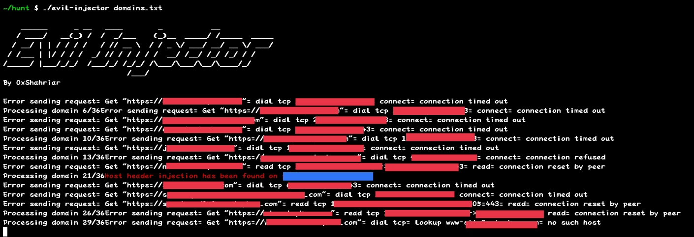

# Evil Injector 😈
Evil Injector is a automated tool for checking host header injection vulnerability.



# How To Use
## For using the bash script:
```bash
chmod +x evil-injector.sh
```
```bash
./evil-injector.sh file.txt
```

## For using the golang script:
```golang
go build evil-injector.go
```
```golang
./evil-injector your_domain_list.txt
```

### Wait patiently until the scanning gets completed. 
